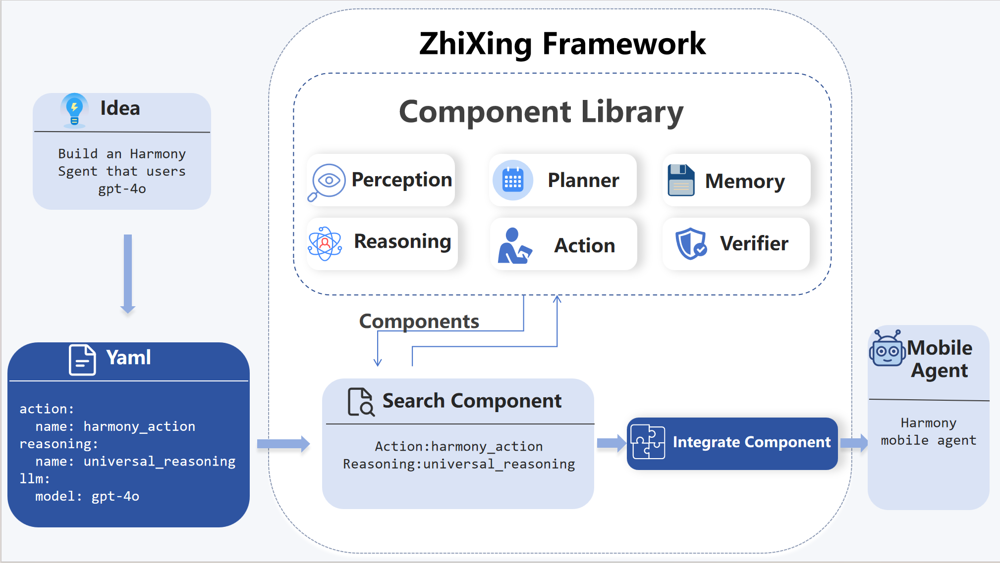
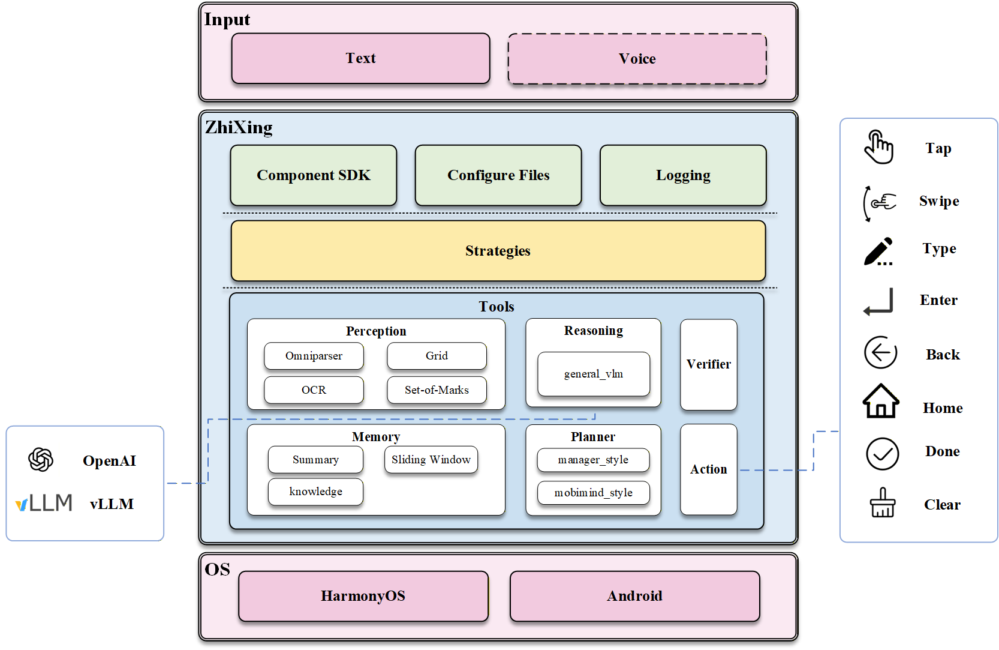

# ZhiXing: A Mobile Agent Development Framework

<p align="center">
  <a href="README_CN.md">中文主页</a> 
</p>

<p align="center">
	<a href="LICENSE"></a>
	
	
</p>


## Introduction

ZhiXing is a development framework for researchers and practitioners to rapidly build and evaluate agents on Android and HarmonyOS smartphones. It supports seamless integration of diverse agent components (e.g., perception and action modules), and allows developers to quickly prototype agents by writing simple YAML configurations. With ZhiXing, developers can move from ideas to working mobile agents in minutes.



#### Why use ZhiXing?

+ **Simple**: build your mobile agents in three minutes with reasoning, planner, perception, memory, verifier and action.

+ **Replaceability**: replace any component in seconds without rewriting code.

+ **Extensible**: support large number of ecosystem integrations for perception, planner.

+ **Research-friendly**: designed for modular assembly and rapid replacement, instead of tightly coupled agent implementations.

  

## 📑 Table of Contents

+ [⚡ Showcase](#Showcase)
+ [🚀 Quick Start](#Quickstart)
+ [🏗️ Architecture](#Architecture)
+ [🧩 Components](#Components)
+ 
+ [🗺️ Roadmap](#Roadmap)
+ [🙌 Contributing](#Contributing)
+ [📄 License](#License)


## ⚡ Showcase<a id="Showcase"></a>

ZhiXing builds agents by editing configuration files. You do NOT need to modify framework code. Just edit YAML → run → get a new agent.

#### Agent A

**Task:** *send an email to lusanedevereaux@gmail.com to ask how her work has been going recently*

<p align="center">
  <video width="650" controls>
    <source src="https://github.com/user-attachments/assets/214e7a28-c038-4b5c-b463-0af0bab2ba08" type="video/mp4">
  </video>
</p>


Change only a few lines in the yaml config:

```yaml
action: harmony
perception: omniparser
llm: gpt-4o
...
```

#### Agent B

**Task:**  *Search for Bluetooth headphones in the Huawei Mall and share the most expensive one with Xiao Zhang via wechat.*

https://github.com/user-attachments/assets/6e5747fb-a05e-4326-8a87-19a568b02b42

⚠️ ZhiXing is a development framework for building and evaluating agents — not an agent algorithm itself.


## 🚀 Quick Start<a id="Quickstart"></a>

### 1. Installation

```Bash
# 1.  Create and activate virtual environment
conda create -n unimobile python=3.10
conda activate unimobile

# 2. Clone the repository
git clone https://github.com/apbocldueo/unimobile.git
cd unimobile

# 3. Install dependencies
pip install -r requirements.txt
```

### 2.  Device Setup

ZhiXing supports both Android and HarmonyOS platforms.

- 📱 **Android Users**: Ensure adb devices shows your device.
- 📱 **HarmonyOS Users**: Ensure hdc list targets shows your device.

📘 **First time setup?** Check our [**Device Connection Guide**](docs/device_setup.md) for step-by-step instructions on enabling USB debugging and installing tools.

### 3. Run

Create a file named `configs/secrets.yaml` and fill in your keys:

```yaml
api_key: "sk-..."
base_url: "https://api.openai.com/v1"
omniparser_url: "http://..." # (Optional)
```

Run the default Android demo:

```bash
python run.py --config configs/agent_android_classic.yaml
```

After running, you can **type your task directly in the terminal**


## 🏗️ Architecture<a id="Architecture"></a>

ZhiXing follows the common modular agent architecture used in modern LLM agents, including Perception, Planning, Reasoning, Memory, Action, and Verifier (For detailed descriptions of each component, see [Components](#Components).).

Instead of tightly coupling these parts, we decouple them into independent, replaceable components, allowing researchers to freely swap algorithms and models without modifying the core system.

See the diagram below.



*Note: Solid blocks represent modules implemented in v0.1, while dashed blocks indicate planned features.*


## 🧩 Components<a id="Components"></a>

Based on the public mobile aent architecture, ZhiXing decouples the agent into six components as follows. You can mix-and-match built-in implementations or inject your own via plugins.

| Module           | Role              |
| ---------------- | ----------------- |
| **👀 Perception** | Eye               |
| **🧠 Reasoning**  | Decision Core     |
| **🗺️ Planner**    | Planner           |
| **💾 Memory**     | Memory Hub        |
| **🦾 Action**     | Hands & Feet      |
| **🛡️ Verifier**   | Quality Inspector |

> 📘 **Documentation**: 
>
> + To detail understanding of the components and what replaceable components are available, see [Component Overview](docs/components.md). 
>
> + If you want to see how to use this component in a yaml file, see [configuration](docs/yaml.md)
>
> *   To develop your own custom component, check the [Plugin Development Guide](docs/plugin_guide.md).


## 🗺️ Roadmap<a id="Roadmap"></a>

### **v0.1 - The Foundation**
- [x] **Hardware Layer**: Unified encapsulation for HarmonyOS/Android dual platforms.
- [x] **Application Layer**: Implemented core ConfigLoader engine for rapid Mobile Agent construction via YAML.
- [x] **Component Ecosystem**: Integrated basic components like OmniParser, OpenAI LLM, summary_memory.

### **v1.0 - Enhancement**
- [ ] **Advanced Strategies**: Implement **Exploration** and **Reflection** strategies for agent self-evolution.
- [ ] **Knowledge Base**: Preliminary support for RAG knowledge base.
- [ ] **External Adapters**: Fully reproduce SOTA algorithms like AppAgent / Mobile-Agent v2.
- [ ] **Developer SDK**: Open component registration interface to support community contributions.


## 🙌 Contributing<a id="Contributing"></a>

Thanks goes to these wonderful people:


## 📄  License<a id="License"></a>

This project is licensed under the [Apache License](./LICENSE).


If this framework helps your research, please give us a Star! 🌟
