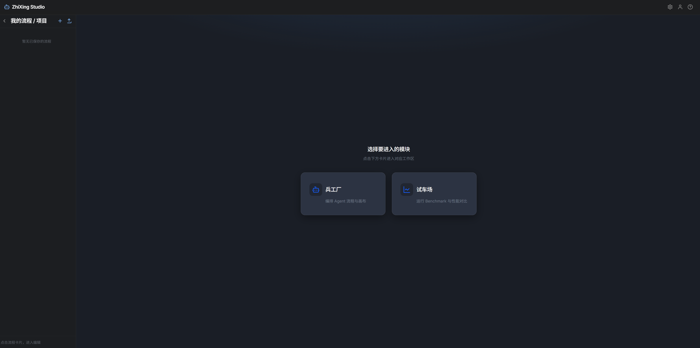
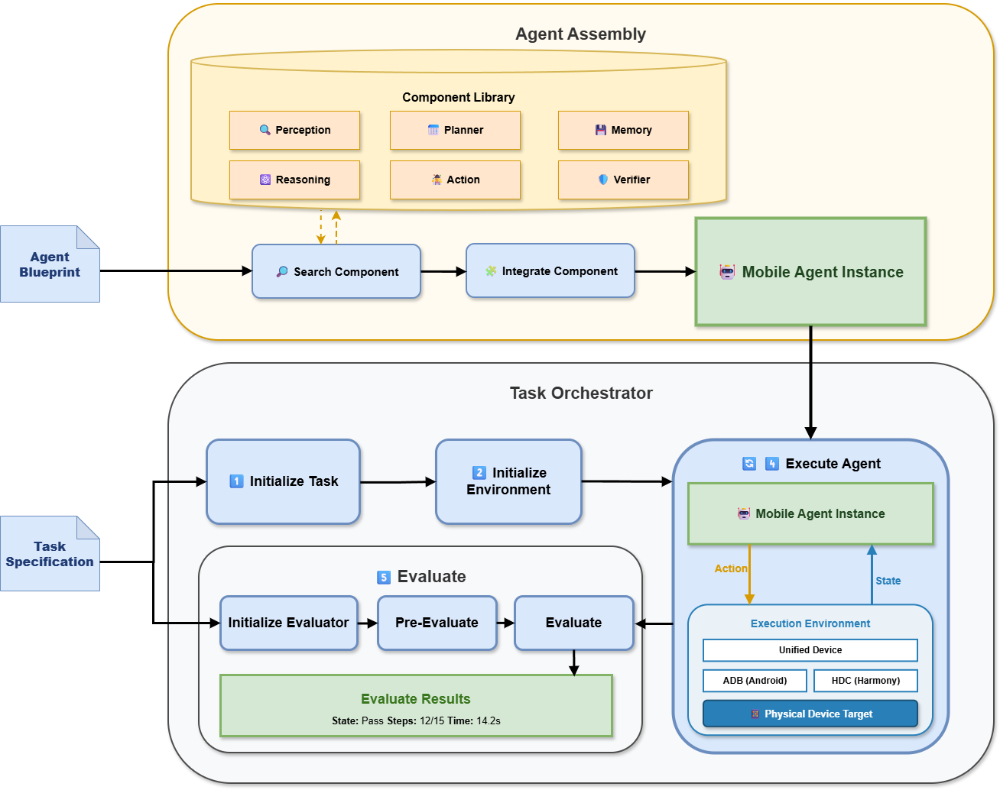

# ZhiXing: A Mobile Agent Development Framework
**以知为本，以行落地——知行 Agent 开发框架**


<p align="center">
  <a href="README_CN.md">Documentation</a> 
</p>

<p align="center">
	<a href="LICENSE"></a>
	
	
</p>


## Introduction

ZhiXing is a development framework for researchers and practitioners to rapidly **build, deploy, and evaluate** agents on Android and HarmonyOS smartphones. Moving beyond simple scripting, it provides an industrial-grade pipeline to assemble customized agents and run automated, sandbox-isolated benchmarks.With ZhiXing, developers can move from ideas to working mobile agents in minutes.

>  📖 **Read the Full Documentation**: Looking for detailed API references, configurations, or architecture Visit our [**Official Documentation Site**]().

+ 🧩 **Zero-Code Agent Build**: Assemble customized perception, reasoning, and action modules using pure YAML configurations.

+ 🧪 **Reproducible Benchmarks:** Build deterministic evaluation pipelines via our powerful JSON DSL.

+ 📱 **Cross-Platform Native:** Deep, native integration with both Android and HarmonyOS ecosystems.

+ 🔌 **Extensible Ecosystem:** IoC factory design to easily plug in your custom component.

  


## 📑 Table of Contents

+ [🚀 Quick Start](#Quickstart)
+  [🖥️ ZhiXing Studio (Web UI)](#Studio)
+ [🏗️ Architecture](#Architecture)
+ [🧩 Components](#Components)
+ [🗺️ Roadmap](#Roadmap)
+ [🙌 Contributing](#Contributing)
+ [📄 License](#License)


## 🚀 Quick Start<a id="Quickstart"></a>

### 1. Installation

```Bash
# 1.  Create and activate virtual environment
conda create -n unimobile python=3.10
conda activate unimobile

# 2. Clone the repository
git clone https://github.com/apbocldueo/unimobile.git
cd unimobile

# 3. Install dependencies
pip install -r requirements.txt
```

### 2.  Device Setup

ZhiXing supports both Android and HarmonyOS platforms.

- 📱 **Android Users**: Ensure adb devices shows your device.
- 📱 **HarmonyOS Users**: Ensure hdc list targets shows your device.

📘 **First time setup?** Check our [**Device Connection Guide**](docs/device_setup.md) for step-by-step instructions on enabling USB debugging and installing tools.

### 3. Run

#### 3.1 secrets

Create a file named `secrets.yaml` and fill in your keys:

```yaml
api_key: "sk-..."
base_url: "https://api.openai.com/v1"
```

#### 3.2 Interactive Mode

If you only want the Agent to help you complete a specific temporary task, start the interaction mode.

```bash
python run.py --agent examples/agent_android_classic.yaml
```

After the program starts, you can directly input the instructions you want the Agent to complete for you in natural language.

#### 3.3 Benchmark Mode

If you want to batch test the capabilities of the Agent or verify the accuracy of the new architecture, start the benchmark mode.

1. Create a new JSON file and fill in the following content:

```json
[
  {
    "id": "quickstart-hello",
    "instruction": "your task"
  }
]
```

2. Run the following instructions:

```bash
python run.py --agent examples/agent_android_classic.yaml --task examples/quickstart_one_task.json
```


## 🖥️ ZhiXing Studio (Web UI)<a id="Studio"></a>

ZhiXing comes with a modern Web UI for buliding agent  and benchmark environment.



To launch the web interface:

```bash
cd studio
npm run dev
```

Then open `http://localhost:5173` in your browser. 


## 🏗️ Architecture<a id="Architecture"></a>

ZhiXing follows the common modular agent architecture used in modern LLM agents, including Perception, Planning, Reasoning, Memory, Action, and Verifier (For detailed descriptions of each component, see [Components](#Components).).

See the diagram below.



*Note: Solid blocks represent modules implemented in v0.1, while dashed blocks indicate planned features.*


## 🙌 Contributing<a id="Contributing"></a>

All thanks to our contributors:

<a href="https://github.com/apbocldueo/unimobile/graphs/contributors">


## 📄  License<a id="License"></a>

This project is licensed under the [Apache License](./LICENSE).


If this framework helps your research, please give us a Star! 🌟
