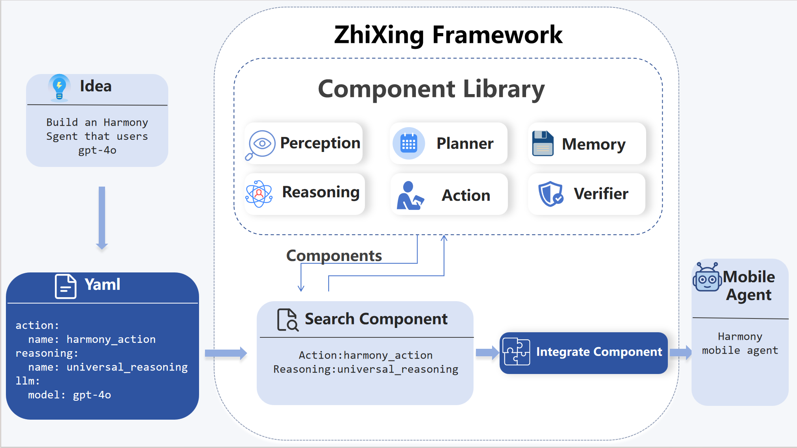
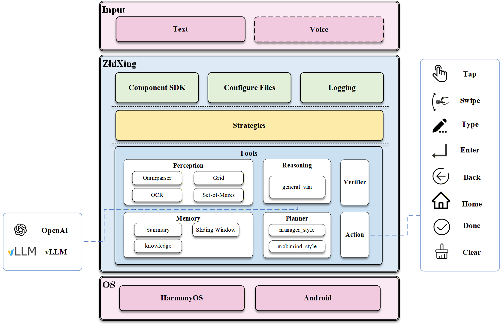

# ZhiXing: A Mobile Agent Development Framework
**以知为本，以行落地——知行 Agent 开发框架**
<p align="center">
  <a href="README_CN.md">中文主页</a> 
</p>

<p align="center">
	<a href="LICENSE"></a>
	
	
</p>


## Introduction

ZhiXing is a development framework for researchers and practitioners to rapidly **build, deploy, and evaluate** agents on Android and HarmonyOS smartphones. Moving beyond simple scripting, it provides an industrial-grade pipeline to assemble customized agents and run automated, sandbox-isolated benchmarks.With ZhiXing, developers can move from ideas to working mobile agents in minutes.

+ 🧩 **Zero-Code Agent Build**: Assemble customized perception, reasoning, and action modules using pure YAML configurations.
+ 🧪 **Reproducible Benchmarks:** Build deterministic evaluation pipelines via our powerful JSON DSL.
+ 📱 **Cross-Platform Native:** Deep, native integration with both Android and HarmonyOS ecosystems.
+ 🔌 **Extensible Ecosystem:** IoC factory design to easily plug in your custom component.




## 📑 Table of Contents

+ [⚡ Showcase](#Showcase)
+ [🚀 Quick Start](#Quickstart)
+ [🏗️ Architecture](#Architecture)
+ [🧩 Components](#Components)
+ [🗺️ Roadmap](#Roadmap)
+ [🙌 Contributing](#Contributing)
+ [📄 License](#License)


## ⚡ Showcase<a id="Showcase"></a>

ZhiXing builds agents by editing configuration files. You do NOT need to modify framework code. Just edit YAML → run → get a new agent.

#### Agent A

**Task:** *send an email to lusanedevereaux@gmail.com to ask how her work has been going recently*


<div align="center">
  <video src="https://github.com/user-attachments/assets/214e7a28-c038-4b5c-b463-0af0bab2ba08"/>
</div>

Change only a few lines in the yaml config:

```yaml
action: harmony
perception: omniparser
llm: gpt-4o
...
```

#### Agent B

**Task:**  *Search for Bluetooth headphones in the Huawei Mall and share the most expensive one with Xiao Zhang via wechat.*

<div align="center">
  <video src="https://github.com/user-attachments/assets/6e5747fb-a05e-4326-8a87-19a568b02b42"/>
</div>


## 🚀 Quick Start<a id="Quickstart"></a>

### 1. Installation

```Bash
# 1.  Create and activate virtual environment
conda create -n unimobile python=3.10
conda activate unimobile

# 2. Clone the repository
git clone https://github.com/apbocldueo/unimobile.git
cd unimobile

# 3. Install dependencies
pip install -r requirements.txt
```

### 2.  Device Setup

ZhiXing supports both Android and HarmonyOS platforms.

- 📱 **Android Users**: Ensure adb devices shows your device.
- 📱 **HarmonyOS Users**: Ensure hdc list targets shows your device.

📘 **First time setup?** Check our [**Device Connection Guide**](docs/device_setup.md) for step-by-step instructions on enabling USB debugging and installing tools.

### 3. Run

Create a file named `configs/secrets.yaml` and fill in your keys:

```yaml
api_key: "sk-..."
base_url: "https://api.openai.com/v1"
omniparser_url: "http://..." # (Optional)
```

Run the default Android demo:

```bash
python run.py --config configs/agent_android_classic.yaml
```

After running, you can **type your task directly in the terminal**


## 🏗️ Architecture<a id="Architecture"></a>

ZhiXing follows the common modular agent architecture used in modern LLM agents, including Perception, Planning, Reasoning, Memory, Action, and Verifier (For detailed descriptions of each component, see [Components](#Components).).

See the diagram below.



*Note: Solid blocks represent modules implemented in v0.1, while dashed blocks indicate planned features.*


## 🧩 Components<a id="Components"></a>

Based on the public mobile agent architecture, ZhiXing decouples the agent into six components as follows. You can mix-and-match built-in implementations or inject your own via plugins.

| Module           | Role              |
| ---------------- | ----------------- |
| **👀 Perception** | Eye               |
| **🧠 Reasoning**  | Decision Core     |
| **🗺️ Planner**    | Planner           |
| **💾 Memory**     | Memory Hub        |
| **🦾 Action**     | Hands & Feet      |
| **🛡️ Verifier**   | Quality Inspector |

> 📘 **Documentation**: 
>
> + To detail understanding of the component library see [Component Overview](docs/components.md). 
>
> + If you want to see how to use this component in a yaml file, see [configuration](docs/yaml.md)
>
> *   To develop your own custom component, check the [Plugin Development Guide](docs/plugin_guide.md).


## 🗺️ Roadmap<a id="Roadmap"></a>

### **v0.1 - The Foundation**
- [x] **Hardware Layer**: Unified encapsulation for HarmonyOS/Android dual platforms.
- [x] **Application Layer**: Implemented core ConfigLoader engine for rapid Mobile Agent construction via YAML.
- [x] **Component Ecosystem**: Integrated basic components like OmniParser, OpenAI LLM, summary_memory.

### **v1.0 - Enhancement**
- [ ] **Advanced Strategies**: Implement **Exploration** and **Reflection** strategies for agent self-evolution.
- [ ] **Knowledge Base**: Preliminary support for RAG knowledge base.
- [ ] **Developer SDK**: Open component registration interface to support community contributions.


## 🙌 Contributing<a id="Contributing"></a>

All thanks to our contributors:

<a href="https://github.com/apbocldueo/unimobile/graphs/contributors">


## 📄  License<a id="License"></a>

This project is licensed under the [Apache License](./LICENSE).


If this framework helps your research, please give us a Star! 🌟
