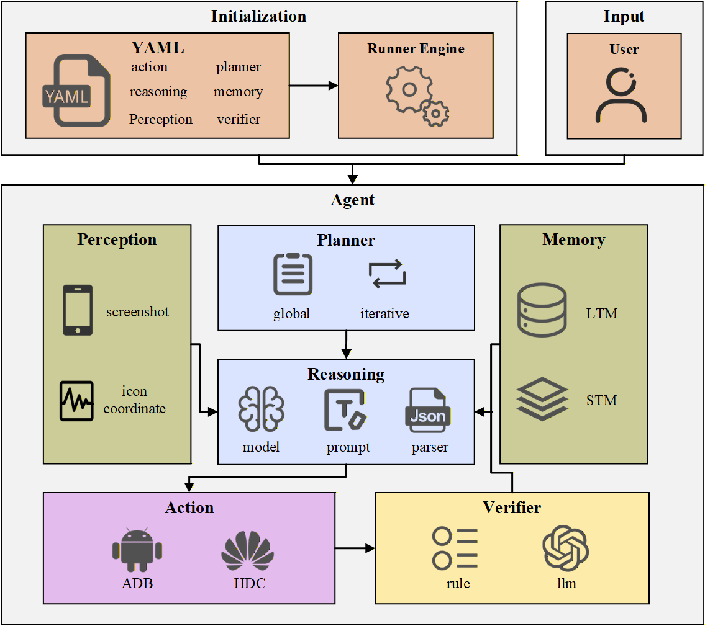

# 知行
知行是一个配置驱动的模块化 Mobile Agent 开发框架，旨在帮助研究者快速构建、测试和对比不同的 Mobile Agent 架构。它提供了一套涵盖感知、规划与执行的模块化组件库，并内置了开箱即用的预设配置，支持研究者在 Android 和 HarmonyOS 双端快速实例化多种架构风格的智能体。借助知行及其提供的丰富资源，您可以在几分钟内轻松搭建并验证一个 Mobile Agent 原型，将您的算法创意迅速转化为真机上的可执行动作。

> 我们的愿景：从一个灵活的开发框架出发，知行将逐步演进为涵盖 **自动化数据生成**、**标准化全链路评测 ** 的全栈智能体科研平台。


## 🏗️ 架构与组件

### 🌍 系统全景

知行采用五层分层架构，涵盖从底层设备接口到顶层应用配置的全栈能力。实线模块为 v0.1 已实装功能，虚线模块为规划中特性。


*注：实线部分为 v0.1 已实装模块，虚线部分为 v1.0/v2.0 规划中模块。*

### 🧠 设计原理

参考 Agent 的定义，我们将 Agent 建模为 **观察 + 推理 + 记忆 + 规划 + 工具** 五个部分，确保其具备类人的自主决策能力。除此之外，我们在组件部分还引入了独立的**验证器**，将 Agent 从传统的“开环执行”升级为具备 自我修正 能力的闭环系统。

最终，移动端智能体被分为了六个完全解耦的核心组件（对应架构图 L2 层），所有组件独立运行、各司其职、无强依赖关系。

### ⚙️ 运行机制

智能体实例化后，将进入‘感知-推理-执行’的闭环运行。下图展示了组件间的数据流向与交互机制



### 🧩 组件详解

| 模块             | 职责与功能                                                   |
| ---------------- | ------------------------------------------------------------ |
| **👀 Perception** | 智能体的**眼睛**，完成移动端的多模态输入解析，唯一负责从手机端获取环境信息，是智能体与物理设备的唯一感知入口。 |
| **🧠 Reasoning**  | 智能体的**决策中枢**，是整个智能体的核心模块，承接规划器的子任务序列，结合感知信息 + 记忆信息，输出每一步该执行什么具体操作的精准决策 |
| **🗺️ Planner**    | 智能体的**战略大脑**，可将用户的总目标拆解为可执行的、有序的、细粒度的子任务序列 |
| **💾 Memory**     | 智能体的**完整记忆中枢**，一体化管理短期与长期双模式记忆，是智能体的状态存储核心 |
| **🛡️ Verifier**   | 智能体的**质检员**，用于校验上一步动作执行的结果是否正确、操作是否有效、是否达成预期目标，是智能体的自检核心 |
| **🦾 Action**     | 智能体的**手脚**，唯一负责将大脑输出的决策，转化为手机端的真实操作，是整个智能体的核心落地组件。 |


## 🔥 核心特性

### 1. 真正的架构级解耦

我们解决了微调模型与通用模型接口不统一的工程难题。

- **Universal Reasoning & Planner**：通过独创的 预设(Preset) 机制，我们将 Prompt 模板、模型调用与结果解析器动态绑定。

### 2.  极致的配置驱动

将 Mobile Agent 的构建过程从‘编写代码’简化为‘配置定义’

- **零代码组装**：通过 YAML 文件即可定义 Agent 的全貌。非开发人员也能通过简单的配置，像搭积木一样快速组装专属 Mobile Agent 实例。

- **组件切换**：专为科研实验设计。想要对比 OmniParser vs Grid 的感知差异？只需修改配置文件中的一行参数，即可实现控制变量的对比实验。

  

## 🚀 快速开始

### 1. 安装依赖

```Bash
# 1. 创建并激活虚拟环境
conda create -n unimobile python=3.10
conda activate unimobile

# 2. 克隆项目
git clone https://github.com/apbocldueo/unimobile.git
cd unimobile

# 3. 安装项目依赖
pip install -r requirements.txt
```

### 2. 连接设备

知行 支持 Android 和 Harmony 双平台。

#### 连接 Android 设备

1. 在您的安卓设备上下载并安装 [ADBKeyboard](https://github.com/senzhk/ADBKeyBoard/blob/master/ADBKeyboard.apk)。

2. 手机端：设置 → 关于手机 → 连续点击「版本号」7 次，开启「开发者选项」

3. 在开发者选项中，开启「USB 调试」

4. 用 USB 数据线连接电脑，并同意电脑调试授权。

5. 验证连接（终端执行，出现设备序列号即成功）

   ```bash
   adb devices
   ```

#### 连接 Harmony 设备

1. 确保已安装鸿蒙 HDC 工具链，下载地址：[HDC](https://developer.huawei.com/consumer/cn/download/command-line-tools-for-hmos)。下载完成后将 HDC 加入系统环境变量。

2. 开启手机的USB 调试

3. 验证连接（终端执行，出现设备序列号即成功）

   ```bash
   hdc list targets
   ```

### 3. 配置文件

我们通过 YAML 定义 Agent。以下是一个 **"经典 Android Agent"** 的配置示例：

```yaml
# ====================================================
# [案例] 构建一个基于视觉感知的经典 Android Agent
# ====================================================

# 1. 顶层定义：定义 Agent 的架构策略
# 命名逻辑：[策略类型]_agent
agent_type: "modular_agent"  # 目前支持模块化组装策略

agent:
  components:
    # 2. 执行组件：负责将指令落地到设备
    # 命名逻辑：[平台]_action
    action:
      name: "android_action" # Android 平台执行器
      params: {}

    # 3. 感知组件：负责屏幕信息的解析
    # 命名逻辑：[算法名]_perception
    perception:
      name: "grid_perception" # 网格坐标感知
      params: {}
        
    # 4. 推理组件 (大脑)：负责单步决策
    # 命名逻辑：universal_reasoning (通用推理) + preset (预设风格)
    reasoning:
      name: "universal_reasoning"
      params:
        preset: "general_vlm_type" # 预设：通用视觉大模型风格
      llm:  # 模型配置
      	name: "openai_llm" # openai 模型
        params:
          api_key: "sk-xxx"  # 你的 OpenAI API 密钥
          base_url: "https://api.openai.com/v1"
          model: "gpt-4o"
          temperature: 0.1
          max_tokens: 2048

    # 5. 记忆组件：负责上下文管理
    # 命名逻辑：[策略名]_memory
    memory:
      name: "sliding_window_memory" # 滑动窗口记忆策略
      params: { window_size: 6 }

    # 6. 规划组件：负责长程任务拆解
    # 命名逻辑：universal_planner (通用规划) + preset (预设风格)
    planner:
      name: "universal_planner" 
      params:
        preset: "manager_style" # 预设：分步拆解风格
      llm:  # 模型配置
      	name: "openai_llm" # openai 模型
        params:
          api_key: "sk-xxx"  # 你的 OpenAI API 密钥
          base_url: "https://api.openai.com/v1"
          model: "gpt-4o"
          temperature: 0.1
          max_tokens: 2048

```

### 4. 现有组件清单

v0.1 版本已内置以下核心组件，支持自由组合：

| 模块           | 可用组件名                                 | 说明                                                         |
| :------------- | :----------------------------------------- | :----------------------------------------------------------- |
| **Reasoning**  | `universal_reasoning` (`general_vlm_type`) | **视觉决策核心**：基于通用多模态大模型，具备直接理解屏幕截图并输出 JSON 格式原子动作的能力。 |
| **Planner**    | `universal_planner` (`manager_style`)      | **分步规划策略**：将复杂用户指令拆解为 "Step-by-step" 的线性子目标序列，适用于长程复杂任务。 |
|                | `universal_planner`(`mobimind_style`)      | **结构化路由策略**：可通过结合知识库数据，智能选择目标 App 并生成结构化的操作意图。 |
| **Perception** | `omniparser_perception`                    | **语义解析**：利用 OmniParser 模型将屏幕截图转化为包含文本、类型和坐标的结构化元素列表。 |
|                | `grid_perception`                          | **网格定位**：经典的通用兜底方案，不依赖元素识别。           |
|                | `som_perception`                           | **视觉打标**：基于 Set-of-Marks (SoM) 技术，在 UI 元素上叠加数字标签，辅助模型进行高精度的 ID 索引操作。 |
| **Memory**     | `sliding_window_memory`                    | **滑动窗口**：仅保留最近 N 步的历史操作上下文，在 Token 成本与上下文连续性之间取得平衡。 |
|                | `summary_memory`                           | **摘要记忆**：对长程历史记录进行周期性压缩与总结，确保 Agent 在长期运行中不遗忘关键信息。 |
| **Action**     | `android_action`                           | **安卓执行适配器**：封装 ADB 指令集，支持点击、滑动、输入等原子操作在 Android 设备上的落地。 |
|                | `harmony_action`                           | **鸿蒙执行适配器**：封装 HDC 协议与鸿蒙原生控制接口，实现对 HarmonyOS NEXT 设备的自动化控制。 |


## 🚀 运行 Demo：体验架构多样性

为了验证知行项目的灵活性，我们构建了 两套完全不同的 Agent 架构，并测试了它们在 三个不同难度场景下的表现。

> 💡 提示：
>
> 1. 在运行以下示例之前，请在 yaml 文件的`api_key` 和 `base_url` 部分输入您的模型密钥。
> 2. perception 若使用 OmniParser 方式，需首先启动 OmniParser 的模型服务。访问 [OmniParser 官方仓库](https://github.com/microsoft/OmniParser) 并在 yaml 文件中填写您的 omniparser-url

### 🎬 实测场景

**场景 A：Android 端 YouTube 搜索视频**

- **配置组合**：Manager Planner +  Grid Perception + Sliding Window Memory
- **特点**：模拟了通用大模型处理手机任务的标准范式。

```bash
# 前置条件：手机已安装 YouTube 
# 任务：在 YouTube 搜索 DFS 算法并播放第一个视频
python run.py --config configs/agent_android_classic.yaml \
  --task "Search for the 'dfs algorithm' using youtube and play the first video that appears"
```


https://github.com/user-attachments/assets/611fe037-b512-4de8-ba05-9513e259f9e7


**场景 B：HarmonyOS 端美团点外卖 **

- **配置组合**：MobiMind Planner + OmniParser + Summary Memory
- **特点**：利用了更先进的 OmniParser 屏幕解析器和结构化输出，执行更加精准高效。

```bash
# 前置条件：手机已安装美团并登录
# 任务：使用美团点一份黄焖鸡米饭，口味选择微辣, 最终停到支付界面即可
python run.py --config configs/agent_harmony_advanced.yaml \
  --task "使用美团点一份黄焖鸡米饭，口味选择微辣, 最终停到支付界面即可"
```

https://github.com/user-attachments/assets/59325b57-927e-4b07-820b-0e271196e3d3

**场景 C： HarmonyOS 跨应用协作 Agent**

* **配置组合**：同场景 B

* **特点**：展示了 Agent 在多 App 间的能力

```bash
# 前置条件：手机已安装华为商城、微信，微信存在联系人「小张」
# 任务：在华为商城中搜索蓝牙耳机，并将价格最高的一款耳机通过微信分享给小张
python run.py --config configs/agent_harmony_advanced.yaml \
  --task "在华为商城中搜索蓝牙耳机，并将价格最高的一款耳机通过微信分享给小张""
```

https://github.com/user-attachments/assets/6e5747fb-a05e-4326-8a87-19a568b02b42


## 🗺️ Roadmap

### **v0.1 - The Foundation**
- [x] **硬件层:** 完成 HarmonyOS/Android 双端统一封装。
- [x] **应用层**：落地 ConfigLoader 核心引擎，可通过 yaml 文件快速搭建 Mobile Agent。
- [x] **组件生态**：集成 OmniParser, summary_memory 等基础组件。

### **v1.0 - Enhancement**
- [ ] **Knowledge Base**: 初步的外部知识库支持
- [ ] **Advanced Strategies**：完成 **Exploration**与 **Reflection** Agent 策略，实现 Agent 的自我进化
- [ ] **External Adapters**: 完整复现 AppAgent / Mobile-Agent v2 等 Mobile Agent 领域 SOTA 算法
- [ ] **Developer SDK**: 开放组件注册接口，支持社区贡献自定义组件


## 📄 协议

本项目遵循 [Apache License](./LICENSE) 开源协议。


如果这个框架对你的研究有帮助，请给我们点个 Star! 🌟
