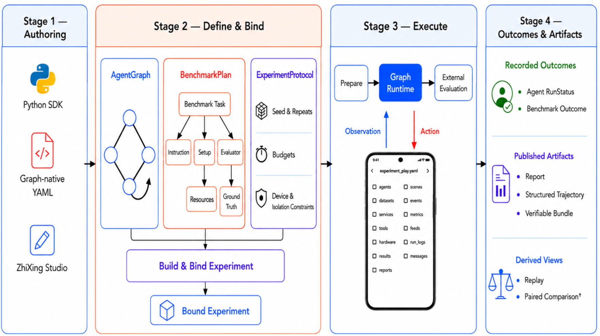

# 知行 ZhiXing

**用可复用 AgentGraph 构建、运行和评测 Mobile Agent，并保留可审计的实验依据。**

[English](README.md) · [文档总览](docs/project-overview.md) · [示例](examples) · [Studio](docs/studio-roadmap.md)

ZhiXing 将通常被硬编码在一起的三件事分开：Agent 如何工作、任务意味着什么，以及在
什么条件下进行评测。它们可被独立定义、组合运行，并保留检查结果所需的证据。

## 快速开始

ZhiXing 需要 Python 3.10+。

```bash
git clone https://github.com/apbocldueo/unimobile.git
cd unimobile
python -m pip install -e ".[openai,dev]"

# 无需设备或 API key。
python examples/agent_graph_runtime_no_device.py
```

这个无设备示例会验证图构建与确定性 Runtime 行为，不会连接手机或解析模型密钥。

## 你可以做什么

- **构建 Agent：** 用 Python、图原生 YAML 或 ZhiXing Studio；所有编写方式都会编译为
  `AgentGraph`。
- **运行可控 Benchmark：** 将 AgentGraph 与 `BenchmarkPlan`、`ExperimentProtocol`
  组合执行。
- **检查证据：** 独立记录 Agent 状态与 Benchmark 结果，并保留 report、结构化
  trajectory、Replay 与可校验 bundle。

## 工作原理



1. **编写：** 使用 Python SDK、图原生 YAML 或 Studio 创建 `AgentGraph`。
2. **绑定：** 将它与独立的 BenchmarkPlan、ExperimentProtocol 组合。
3. **执行：** 经 `ObservationProvider`、`ActionExecutor` 等显式设备边界运行。
4. **检查：** 查看 Agent 状态、外部任务 verdict 和保留的产物。

`AgentGraph` 定义 Agent 行为；`BenchmarkPlan` 定义任务 setup 与 evaluation；
`ExperimentProtocol` 固定 seed、repeats、预算和设备约束。修改其中之一不会静默改写另外两者。

## 接下来

| 我想要… | 从这里开始 |
| --- | --- |
| 理解核心架构 | [项目总览](docs/project-overview.md) |
| 编写 AgentGraph | [AgentGraph 指南](docs/agent-graph.md) |
| 连接 Android 设备 | [设备连接](docs/device_setup.md) |
| 运行内置 Android 图 | [Android Runtime 指南](docs/builtin-agentgraph-runtime.md) |
| 创建或运行 Benchmark | [Benchmark 架构](docs/benchmark-architecture.md) |
| 使用可视化工作区 | [Studio 路线图](docs/studio-roadmap.md) |
| 查看可运行定义 | [示例](examples) |

### 启动 Studio

```bash
python -m zhixing.studio

# 在另一个终端
cd studio
npm ci
npm run dev
```

访问 `http://127.0.0.1:5173/`。

### 运行 Android 示例

```bash
cp secrets.example.yaml secrets.local.yaml
adb devices
zhixing run \
  --agent examples/graphs/builtin_android_agent.yaml \
  --serial emulator-5554 \
  --secrets secrets.local.yaml
```

请在本地替换示例 serial 和密钥；不要提交凭据或真实设备配置。

## 当前范围

ZhiXing 是 alpha 阶段的研究与工程框架，拥有 fake-device 和有界 Android 验证证据。
它不宣称支持任意 Agent 范式、任意 Android 任务、广泛设备兼容、自动失败诊断，或对
任意第三方插件的安全沙箱隔离。

完整的验证命令、打包、正式开源发布、贡献、安全和引用说明请见
[文档总览](docs/project-overview.md)、[CONTRIBUTING.md](CONTRIBUTING.md)、
[SECURITY.md](SECURITY.md) 与 [CITATION.cff](CITATION.cff)。

ZhiXing 源代码使用 [Apache License 2.0](LICENSE)。
